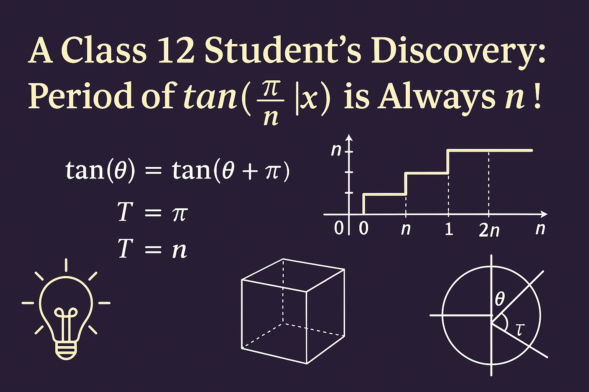

# trig-period-GIF-discovery
“A Class 12 student's discovery: Period of tan(π/n ⌊x⌋) is always n.”

# 📐 Period of `tan(π/n [x])` is Always `n` – A Trig Discovery

Discovered by Arpit Kumar, Class 12 Student  
_Inspired by JEE prep & love for patterns._

## 🔍 How I Found It
While preparing for my JEE exams...
